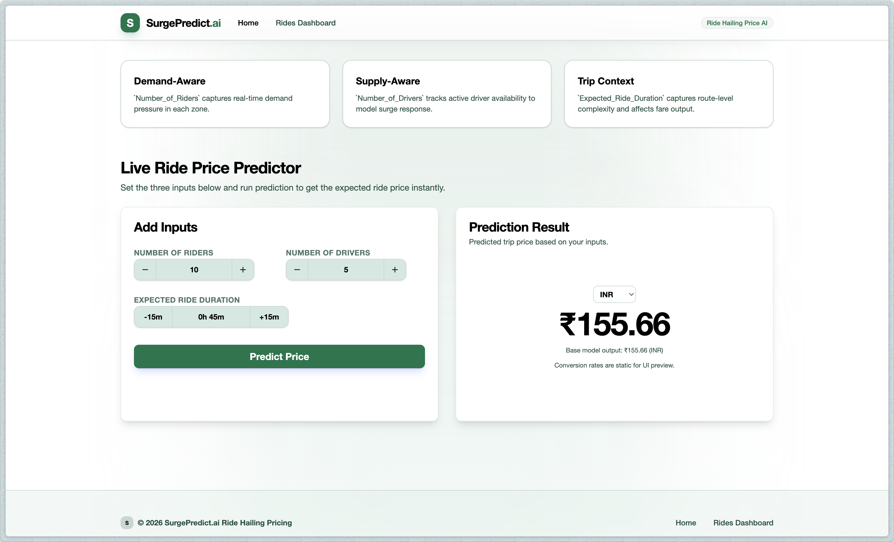
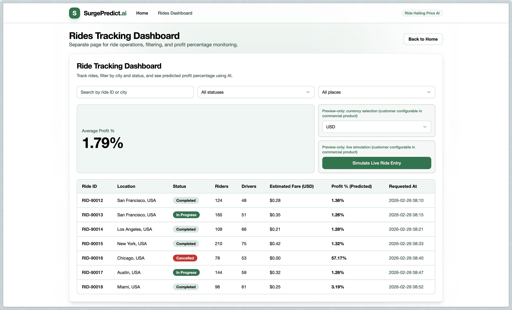

# Dynamic Surge Pricing — ML Modeling Pipeline

## Problem Statement

Our ride-sharing company currently sets fares based **only on ride duration**, using a fixed pricing rule that ignores real-time market conditions.

As a result, during peak hours (e.g., office closing time with heavy rain) this leads to:

- 🕐 Long waiting times for riders
- ❌ Ride cancellations
- 🚗 Inefficient driver allocation

## Overview
The frontend is a Vite + React + TypeScript app for:
- live ride price prediction
- a separate rides tracking page
- ride filtering, currency display, and simulation preview controls

## Stack and Tech
- React 19 (`react`, `react-dom`)
- TypeScript 5
- Vite 7 (dev server + build)
- Tailwind CSS 4 (design system + utility styling)
- Framer Motion (animations)
- Axios (API calls)
- Radix UI primitives (`@radix-ui/react-*`) + custom UI wrappers
- `class-variance-authority`, `clsx`, `tailwind-merge` (component style variants)
- ESLint 9 + TypeScript ESLint

## Key App Modules
- `src/App.tsx`: top-level layout and page switching (`#/home`, `#/rides`)
- `src/Dashboard.tsx`: live fare prediction flow
- `src/PredictionResult.tsx`: animated prediction output UI
- `src/RidesDashboard.tsx`: rides table, filters, currency view, simulated entries
- `src/api.ts`: shared API base URL + response types
- `src/components/ui/*`: reusable UI primitives

## API Integration
The frontend reads backend URL from:
- `VITE_API_BASE_URL` (optional)
- fallback: `http://localhost:8001`

Endpoints used:
- `POST /predict`
- `POST /predict-profit-percentages`

## Local Development
```bash
cd frontend
npm install
npm run dev
```

## Build
```bash
cd frontend
npm run build
npm run preview
```

## Screenshots
Add screenshots to `frontend/docs/screenshots/` and update paths below.

### Home Page


### Rides Dashboard


